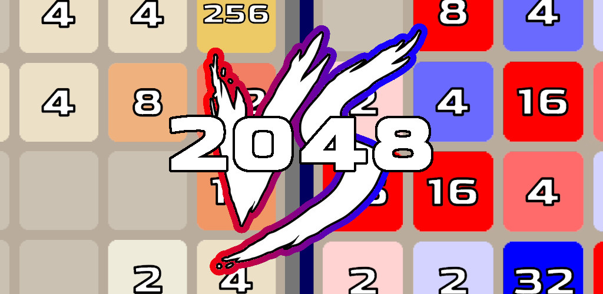
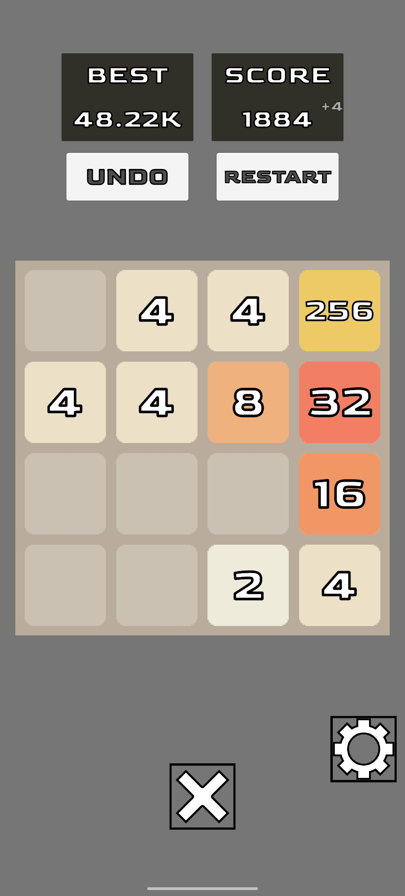
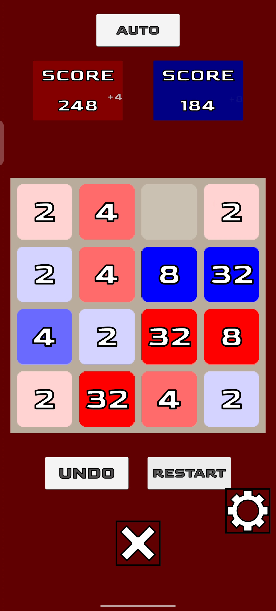
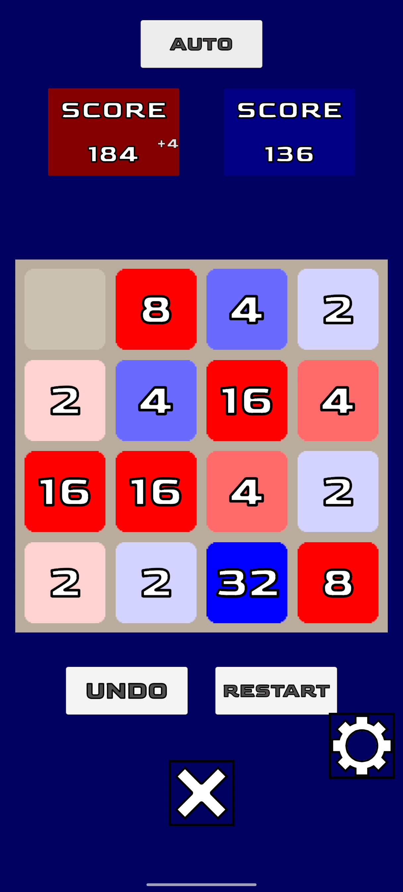

<h1> 2048 Versus</h1>

Play 2048 in a whole new way: solo or with another player!

Aim for the highest tile when playing normal mode.
But in versus: combine matching tiles to reach higher numbers while keeping your opponent from taking the lead.
Capture opposing tiles while protecting your own to claim victory.

Features:
- Single-player and two-player modes
- Simple controls
- Fully offline

Credits:
-- Menu
Song: Alan Walker - Force [8 bit release]
Watch: https://www.youtube.com/watch?v=0h57mFXZQAc

-- Normal
Song: Rob Gasser - Ricochet [NCS Release]
Music provided by NoCopyrightSounds
Free Download/Stream: http://ncs.io/Ricochet
Watch: http://youtu.be/T4Gq9pkToS8

-- Versus Basic
Song: Elektronomia & JJD - Free [NCS Release]
Music provided by NoCopyrightSounds
Free Download/Stream: http://ncs.io/Free
Watch: http://youtu.be/9Va88Kt0NN0

-- Versus Average
Song: Cartoon, LEOWI - Wait A While (ft. Pasha & Merili Käsper)
Music provided by NoCopyrightSounds
Free Download/Stream: http://ncs.io/waitawhile
Watch: http://ncs.lnk.to/waitawhileAT/youtube

-- Versus Advanced
Song: SPIRIT LINK x Swole Sauce - Stay With Me (feat. Tom The Gaffer) [NCS Release]
Music provided by NoCopyrightSounds
Free Download/Stream: http://ncs.io/SWM
Watch: http://youtu.be/
